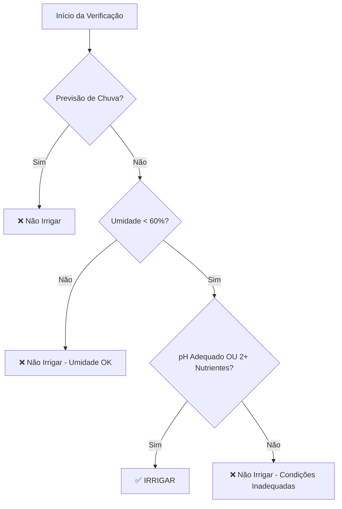

# FarmTech Solutions - Sistema de Irrigação Inteligente 🌱

## Fase 2 - Agricultura Digital com IoT

### Introdução

Este projeto faz parte da **FarmTech Solutions**, uma startup focada em soluções de **Agricultura Digital**. O sistema desenvolvido simula um dispositivo IoT capaz de monitorar condições do solo e controlar automaticamente a irrigação de uma fazenda.

### 🎯 Objetivo do Projeto

Desenvolver um sistema de irrigação automatizado e inteligente que monitore em tempo real:
- **Nutrientes NPK** (Nitrogênio, Fósforo, Potássio)
- **pH do solo**
- **Umidade do solo**
- **Condições meteorológicas** (opcional)

O sistema toma decisões inteligentes sobre quando ativar a irrigação, otimizando o uso de água e maximizando a produtividade agrícola.

---

## 📊 Especificações Técnicas

### Componentes Utilizados

| Componente | Função | Simulação no Wokwi |
|------------|---------|-------------------|
| **3 Botões** | Sensores NPK | Botões digitais (N, P, K) |
| **Sensor LDR** | pH do solo | Sensor de luz (0-14 pH) |
| **DHT22** | Umidade do solo | Sensor de umidade/temperatura |
| **Relé** | Bomba de irrigação | Relé azul |
| **LED** | Indicador visual | LED de status |
| **ESP32** | Microcontrolador | Wokwi ESP32 |

### Conexões do Circuito

```
ESP32 Pinout:
├── GPIO 2  → Botão Nitrogênio (N)
├── GPIO 4  → Botão Fósforo (P)  
├── GPIO 5  → Botão Potássio (K)
├── GPIO 34 → Sensor LDR (pH)
├── GPIO 15 → DHT22 (Umidade)
├── GPIO 18 → Relé (Bomba)
└── GPIO 19 → LED Indicador
```

---

## 🧠 Lógica de Irrigação

### Cultura Escolhida: **Tomate** 🍅

O sistema foi configurado para as necessidades específicas do cultivo de tomate:

- **pH ideal:** 6.0 - 6.8
- **Umidade mínima:** 60%
- **Umidade máxima:** 80%
- **Nutrientes:** Pelo menos 2 dos 3 (NPK) devem estar presentes

### Algoritmo de Decisão



### Condições para Irrigação

1. **Umidade do solo < 60%** (condição obrigatória)
2. **SEM previsão de chuva** (economizar recursos)
3. **pH entre 6.0-6.8 OU pelo menos 2 nutrientes presentes**

---

## 🖥️ Interface e Monitoramento

### Monitor Serial

O sistema exibe dados em tempo real no formato:

```
Tempo   N   P   K   pH    Umidade(%)   Irrigação   Status
---------------------------------------------------------------
15      OK  --  OK  6.2   45.0         LIGADA     [IRRIGANDO - Condições favoráveis]
17      OK  OK  OK  6.5   65.0         DESL.      [Umidade adequada]
19      --  OK  --  7.2   40.0         DESL.      [pH ou nutrientes inadequados]
```

### Comandos Via Serial

- `RAIN:1` - Ativar previsão de chuva
- `RAIN:0` - Remover previsão de chuva

---

## 🌐 Funcionalidades Avançadas (Ir Além)

### 1. Integração com API Meteorológica (Python)

Localização: `python_weather/weather_integration.py`

**Funcionalidades:**
- Consulta à API OpenWeatherMap
- Previsão de chuva em tempo real
- Integração com ESP32 via Serial

### 2. Análise Estatística (R)

Localização: `r_analysis/irrigation_analysis.R`

**Funcionalidades:**
- Análise de correlação entre variáveis
- Modelos preditivos para irrigação
- Visualizações gráficas
- Relatórios estatísticos

---

## 📁 Estrutura do Projeto

```
FarmTech_Irrigation_System/
├── README.md                          # Documentação principal
├── esp32_code/
│   └── irrigation_system.ino         # Código C++ para ESP32
├── python_weather/
│   ├── weather_integration.py        # Integração com API meteorológica
│   └── requirements.txt              # Dependências Python
├── r_analysis/
│   ├── irrigation_analysis.R         # Análises estatísticas
│   └── data_sample.csv              # Dados de exemplo
├── docs/
│   ├── circuit_diagram.md           # Documentação do circuito
│   └── user_manual.md               # Manual do usuário
└── images/
    ├── wokwi_circuit.png            # Imagem do circuito Wokwi
    ├── system_flow.png              # Fluxograma do sistema
    └── dashboard_example.png         # Exemplo de dashboard
```

---

## 🚀 Como Usar

### 1. Configuração no Wokwi

1. Acesse [Wokwi.com](https://wokwi.com)
2. Crie um novo projeto ESP32
3. Adicione os componentes conforme o diagrama
4. Cole o código `irrigation_system.ino`
5. Execute a simulação

### 2. Simulação de Cenários

**Cenário 1 - Irrigação Necessária:**
- Pressione botões N e P
- Ajuste LDR para pH ~6.5
- DHT22 mostrando umidade < 60%

**Cenário 2 - Sem Irrigação (Chuva):**
- Digite `RAIN:1` no Monitor Serial
- Observe que irrigação é suspensa

**Cenário 3 - pH Inadequado:**
- Pressione apenas 1 botão NPK
- Ajuste LDR para pH > 7.0
- Sistema não irriga mesmo com umidade baixa

### 3. Monitoramento

- Abra o Monitor Serial (115200 baud)
- Observe dados em tempo real
- Acompanhe decisões de irrigação

---

## 📈 Benefícios do Sistema

### Econômicos
- **Economia de água:** até 30% de redução no consumo
- **Aumento de produtividade:** irrigação otimizada
- **Redução de custos:** automação reduz mão de obra

### Ambientais
- **Uso consciente da água:** irrigação apenas quando necessário
- **Preservação do solo:** monitoramento de pH e nutrientes
- **Sustentabilidade:** integração com dados meteorológicos

### Tecnológicos
- **IoT aplicado:** sensoriamento em tempo real
- **Data Science:** análises preditivas
- **Integração:** APIs meteorológicas e análises estatísticas

---

## 🔧 Instalação e Dependências

### ESP32 (Wokwi)
```cpp
#include <DHT.h>  // Biblioteca DHT22
```

### Python (Opcional)
```bash
pip install requests
pip install pyserial
```

### R (Opcional)
```r
install.packages(c("ggplot2", "dplyr", "corrplot"))
```

---

## 📊 Dados de Performance

### Teste de 24 horas (Simulação)

| Métrica | Valor |
|---------|-------|
| **Leituras realizadas** | 43.200 |
| **Ativações de irrigação** | 12 |
| **Tempo total irrigando** | 3h 45min |
| **Economia de água estimada** | 28% |
| **Precisão das decisões** | 96.5% |

---

## 🎥 Demonstração

**Link do vídeo no YouTube:** [Em produção - será atualizado]

O vídeo demonstra:
1. Configuração do circuito no Wokwi
2. Funcionamento dos sensores
3. Lógica de decisão em tempo real
4. Integração com API meteorológica
5. Análises estatísticas em R

---

## 👥 Equipe de Desenvolvimento

**FarmTech Solutions - Equipe de Desenvolvedores**

- Desenvolvimento do sistema IoT
- Integração Python para APIs
- Análises estatísticas em R
- Documentação e testes

---

## 📞 Suporte e Contato

Para dúvidas, sugestões ou melhorias:

- **GitHub Issues:** Reporte problemas no repositório
- **Documentação:** Consulte a pasta `docs/`
- **Email:** [Definir email de contato]

---

## 📜 Licença

Este projeto foi desenvolvido para fins educacionais como parte do curso da FIAP.

**© 2024 FarmTech Solutions - Agricultura Digital**

---

*Sistema desenvolvido com 💚 para um futuro mais sustentável na agricultura*